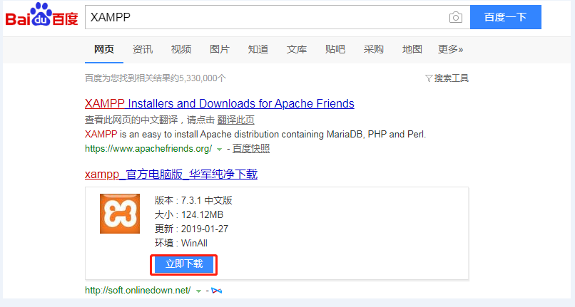

# XMAPP的安装与配置
本章节我们主要讲解用来搭建模拟服务器的XMAPP一站式服务软件

### 1、XMAPP简介
#### 1.XAMPP（Apache+MySQL/MariaDB+PHP+Perl）

　  开头的X代表X-OS，代表可以在任何常见操作系统下使用，包括Windows、Mac、Linux，开源平台。

XAMPP（Apache+MySQL+PHP+PERL）是一个功能强大的建站集成软件包。这个软件包原来的名字是 LAMPP，但是为了避免误解，最新的几个版本就改名为 XAMPP 了。它可以在Windows、Linux、Solaris、Mac OS X 等多种操作系统下安装使用，支持多语言：英文、简体中文、繁体中文、韩文、俄文、日文等。
许多人通过他们自己的经验认识到安装 Apache 服务器是件不容易的事儿。如果您想添加 MySQL、PHP 和 Perl，那就更难了。XAMPP 是一个易于安装且包含 MySQL、PHP 和 Perl 的 Apache 发行版。XAMPP 的确非常容易安装和使用：只需下载，解压缩，启动即可。
 

#### 2.XAMPP的下载：
百度搜索XMAPP第一行请看下面这张图



点击普通下载

### 2、安装XMAPP
#### 1.首先我在桌面创建了一个文件夹XMAPP，然后在XMAPP创建了三个文件夹。

#### 2.首先下载好XMAPP，放到一个位置，我放在 D:\XAMPP\package 这个位置的。


#### 3.然后双击，进入安装界面。

我将安装路径选择了C:\XAMPP\path

一直next...

#### 4.直到安装完毕打开软件是这个样子的。


#### 5.然后我点击了5个start，全部绿灯


#### 6.是红灯的话
如果是Apache中的80,443端口被占用
如果是MySQL中的3306端口被占用

### 3、配置虚拟主机
#### 1.然后我在C:\XMAPP\virtualhost中新建了一个文件==>index.php


很简单的一个函数，就当做首页了吧。

#### 2.找到XAMPP的安装目录==>apache==>conf==>extra

然后用编辑器打开httpd-vhosts.conf

在文件的最下面写如下代码：　

``` php
<VirtualHost *:80>
 ServerName jasonjan.com
 DocumentRoot "D:/XAMPP/virtualhost"
<Directory "D:/XAMPP/virtualhost"> 
 Options FollowSymLinks IncludesNOEXEC Indexes
 DirectoryIndex index.html index.htm index.php
 AllowOverride all 
 Order Deny,Allow 
 Allow from all 
 Require all granted
</Directory>
</VirtualHost>
```

效果图：

#### 3.修改hosts(要以管理员身份运行编辑器)
进入C盘==>Windows==>system32==>drivers==>etc==>找到hosts这个文件

把127.0.0.1 jasonjan.com 填写到hosts最后面

127.0.0.1是你网络地址,后面的jasonjan.com是你虚拟主机定义的访问名称


### 4、测试是否XAMPP成功运行
#### 1.先打开Apache


#### 2.在浏览器中输入 主机名==>我的主机名为：
jasonjan.com

