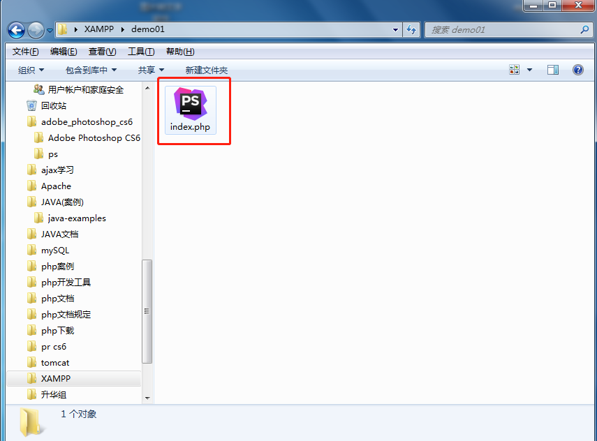

# 第04节:第一个php程序
本章节我们把之前学的知识来汇集一下,通过XAMPP来搭建集成服务器,写第一个php程序,一共七步,这样我们就可以踏进php的门槛啦

### 一、我的第一个HelloWorld
#### 1.打开我们安装的集成服务器XAMPP

#### 2.打开了xampp后，看到这个Apache，点击Start

#### 3.等到这个按钮变成了绿色了后，就证明我们已经开启了php的环境

#### 4.根据安装xampp的地址，根据顺序打开,我的路径是C:\Users\Administrator\Desktop\XAMPP\virtualhost

#### 5.打开后，新建php文件，记住后缀名为 .php,我这儿新建了一个文件夹为index

#### 6.用编程工具打开刚才创建的index.php文件，打开php文件后输入以下代码保存就好了

#### 7.开游览器输入：localhost/index.php这就是我们刚才做的项目了

好了，这就是我们的第一个php项目，初学者的第一步，我们已经成功的踏出了