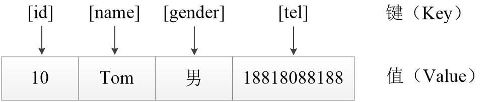

# 数组
本章节我么来讲解php当中使用比较广泛的数组

### PHP数组
数组是PHP中最重要的数据类型之一，在PHP中广泛应用。相比标量类型的变量只能保存一个数据，使用复合类型的数组变量能够保存一批数据，从而很方便地对数据进行分类和批量处理。

### 目录
#### 1、初始数组
* 索引数组
* 关联数组

####  2、数组的基本使用
* 数组的定义
* 赋值方式

#### 一、初始数组
##### 1.索引数组
索引数组是指键名为整数的数组。默认情况下，索引数组的键名是从0开始，并依次递增。主要使用于利用位置（0,1,2,3，…）来标识数组元素的情况，索引数组的键名也可以自己指定。

##### 2.关联数组
关联数组是指键名为字符串的数组。通常情况下，关联数组元素的“键”和“值”之间有一定的业务逻辑关系。因此通常使用关联数组存储一系列具有逻辑关系的变量。关联数组的“键”都是字符串，并且与“值”之间具有一一对应的关系。


除此之外，PHP中的数组还可以根据维数划分为一维数组、二维数组、三维数组等。一维数组是指数组的“值”是非数组类型的数据。

#### 二.数组的基本使用
##### 1.数组的定义
数组是一种编程结构，它是一个存储一组或一系列数值的变量。对于数组的定义，PHP中有三种定义方式，分别是array()语言结构法、赋值方式及短数组定义法(不常用,此处就不过多介绍了)。

``` php
<?php
     //1.array()语言结构方式
     //array()语言结构中的数组元素使用“键=>值”的方式进行表示，各元素之间使用逗号进行分隔。
     //(1).定义索引数组
      $fruits = array('apple','grape','pear');  //省略键名
      $sports = array(2=> 'basktball',4=>'swimming');  //指定键名
      //$fruits数组变量，在省略键名的设置时，默认从0开始，一次递增加1，因此该数组元素的键名依次为“0,1,2”。还可以根据实际情况自定义数组元素的键名。
      
      //(2).定义关联数组
      $info = array('id' => 10,'name' => 'Tom','tel' =>18810888188);
      //通过关联数组的键名可以准确的描述出该数组元素的含义。在定义关联数组时，“值”可以是任意类型数据，而“键”则有明确的数据类型的要求，规则如下：
      /*
        1.键只能是整型或字符串类型的数据，如果是其他类型，则会执行类型自动转换
        2.合法整型的字符串会被转为整型
        3.浮点数会被舍去小数部分直接转化成整型
        4.布尔类型的true会被转为1，false转为0
        5.null类型会被转为字符串
      */     

  //(3).定义多维数组
  $data = array(
      0 => array('name' => 'Tom','gender' => '男'),
      1 => array('name' => 'Lucy','gender' => '女'),
      2 => array('name' =>'Jimmy', 'gender ' => '男')
  ) 
  //在定义多维数组时，虽然PHP没有限制数组的维数，但是在实际应用中，为了便利代码阅读、调试和维护，建议使用三维以下的数组保存数据。
?>
```

##### 2.赋值方式
使用赋值方式定义数组就是创建一个数组变量，然后使用赋值运算符直接给变量赋值。

``` php
<?php
 $arr[]= 123;                  //存储结果：$arr[0] = 123
 $arr[] = 'hellow';           //存储结果：$arr[1] = 'hellow'
 $arr[4] = 'PHP';            //存储结果：$arr[4] = 'PHP'
 $arr['name'] = 'Tom';      //存储结果：$arr['name'] = 'Tom'
 $arr[] = 'Java';          //存储结果：$arr[5] = 'Java'
?>
```

提示：赋值方式定义数组就是单独为数组元素赋值。注意，赋值方式不能定义一个空数组。