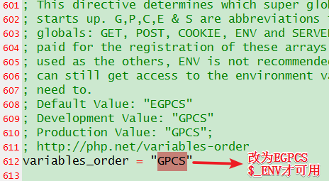
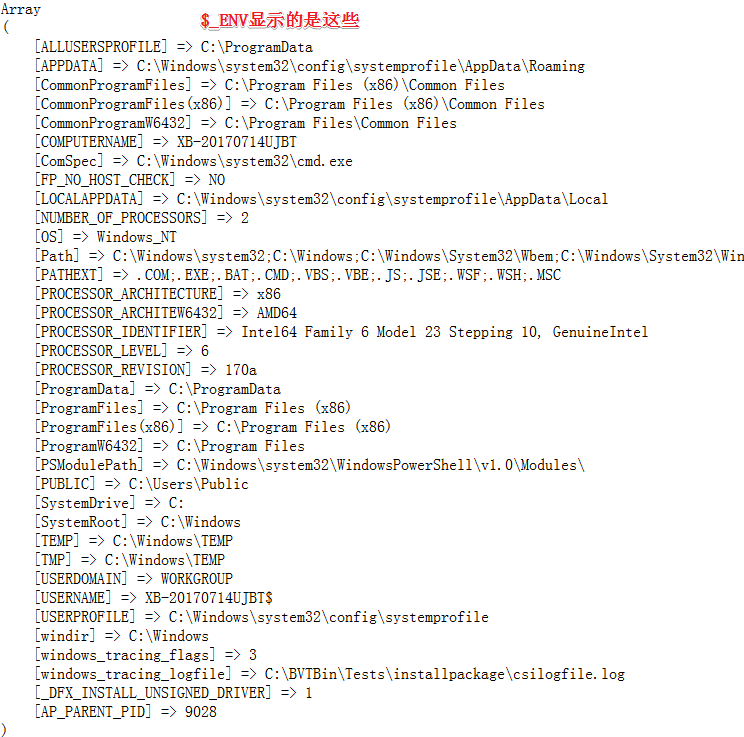
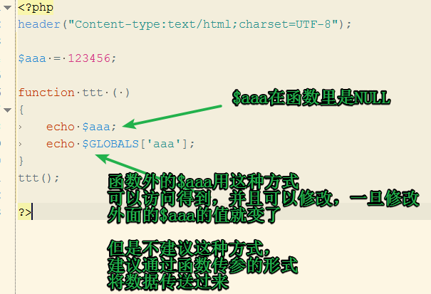

# 超级全局变量

### PHP的超级全局变量
#### 常用超级全局变量有9个:
* $_GET 传送方式
* $_POST 传送方式
* $_REQUEST 可以接收到 get 和 post 两种方式的值
* $GLOBALS 引用全局作用域中可用的全部变量
* $_FILES 上传文件使用
* $_SERVER 系统环境变量
* $_SESSION 用于会话控制
* $_COOKIE 用于会话控制
* $_ENV 服务器端环境变量

$_GET获得的是浏览器地址栏过来的数据，或者表单GET方式提交的数据

$_POST获得的是表单POST方式提交的数据

$_REQUEST默认情况（具体情况要看php.ini的配置）获得的是既包含POST过来的值，也包含GET方式获得的值

如下例子：2222.html上有个表单，提交给2222.php这个文件

``` html
<html>
    <head>
        <title>实验GET POST的区别</title>
        <meta charset="UTF-8"/>
    </head>
    <body>
        <!--本文件2222.html提交数据-->
        <form action="shu.php?id=5678" method="post">
            <input type="text" name="username" value="" />
            <input type="submit" value="提交"/>
        </form>
    </body>
</html>
```

``` php
<?php
header("Content-type:text/html;charset=UTF-8");
echo '<pre>';

//2222.php 接收数据并显示出来
print_r($_GET);
print_r($_POST);
print_r($_REQUEST);

 echo '<pre>';
```


点击提交会跳到form表单 action元素跳的指定php路径


最终的结果，可以看到，\$_REQUEST这个数组是\$_GET和\$_POST合并起来的

#### $_ENV
打印一下$_ENV，print_r($_ENV); 看看出来的是什么？
发现，没有反应！空白。原来，考虑到信息安全问题，php的配置文件php.ini中，variables_order控制着$_ENV的显示


$_ENV里面是操作系统呀什么的这些信息


#### $_SERVER 
打印出来如下：

``` html
Array
(
    [HTTP_HOST] => localhost
    [HTTP_USER_AGENT] => Mozilla/5.0 (Windows NT 6.1; Win64; x64; rv:66.0) Gecko/20100101 Firefox/66.0
    [HTTP_ACCEPT] => text/html,application/xhtml+xml,application/xml;q=0.9,*/*;q=0.8
    [HTTP_ACCEPT_LANGUAGE] => zh-CN,zh;q=0.8,zh-TW;q=0.7,zh-HK;q=0.5,en-US;q=0.3,en;q=0.2
    [HTTP_ACCEPT_ENCODING] => gzip, deflate
    [HTTP_CONNECTION] => keep-alive
    [HTTP_UPGRADE_INSECURE_REQUESTS] => 1
    [HTTP_CACHE_CONTROL] => max-age=0
    [PATH] => C:\Windows\system32;C:\Windows;C:\Windows\System32\Wbem;C:\Windows\System32\WindowsPowerShell\v1.0\;C:\Program Files\nodejs\;C:\Program Files\Git\cmd;
    [SystemRoot] => C:\Windows
    [COMSPEC] => C:\Windows\system32\cmd.exe
    [PATHEXT] => .COM;.EXE;.BAT;.CMD;.VBS;.VBE;.JS;.JSE;.WSF;.WSH;.MSC
    [WINDIR] => C:\Windows
    [SERVER_SIGNATURE] => 
    [SERVER_SOFTWARE] => Apache/2.4.23 (Win32) OpenSSL/1.0.2j PHP/5.4.45
    [SERVER_NAME] => localhost
    [SERVER_ADDR] => ::1
    [SERVER_PORT] => 80
    [REMOTE_ADDR] => ::1
    [DOCUMENT_ROOT] => E:/xxxx
    [REQUEST_SCHEME] => http
    [CONTEXT_PREFIX] => 
    [CONTEXT_DOCUMENT_ROOT] => E:/xxxx
    [SERVER_ADMIN] => admin@phpStudy.net
    [SCRIPT_FILENAME] => E:/xxxx/2222.php
    [REMOTE_PORT] => 2479
    [GATEWAY_INTERFACE] => CGI/1.1
    [SERVER_PROTOCOL] => HTTP/1.1
    [REQUEST_METHOD] => GET
    [QUERY_STRING] => 
    [REQUEST_URI] => /2222.php
    [SCRIPT_NAME] => /2222.php
    [PHP_SELF] => /2222.php
    [REQUEST_TIME_FLOAT] => 1556588895.594
    [REQUEST_TIME] => 1556588895
)
```

#### $GLOBALS 
引用全局作用域中可用的全部变量

它就是个快捷方式集合，把在全局作用域中的全部变量（除了$_ENV）都放在里面了。

``` php
$aaa = 123456;
print_r($GLOBALS);
```



