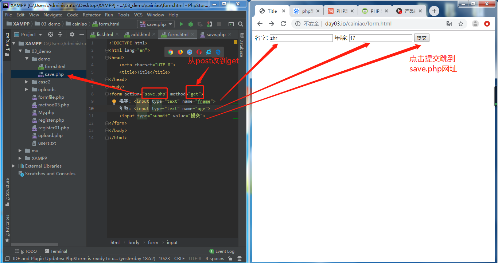
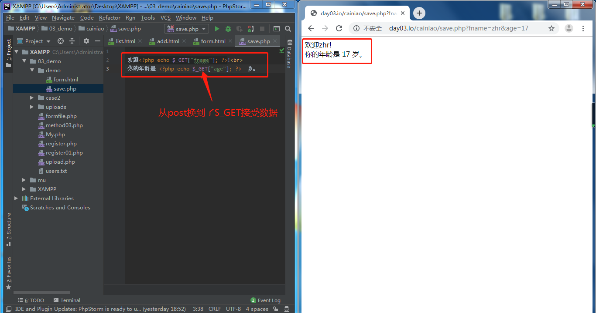

# 第01节:表单提交流程
本节我们简单的了解一下php表单的客户端与服务端交互的流程

### 一、客户端如何发送数据
步骤：
* 1.添加form标签：
对需要提交的信息以及提交按钮用form标签包围
* 2.提交按钮为submit属性:
这个type属性证明是提交的按钮
* 3.form增加以下2个属性，action和method:
其中 action代表提交到的目标处理文件，如本例为与当前文件同级的save.php文件,method则证明提交的方法，有get和post两种方式提交，详见下面的二者区别介绍！
* 4.对发送的数据进行数据包装
增加name字段，用来包装要发布的数据

如下所示：

这是客户端发送表单的图片

### 二、服务端如何接收数据
接收到的数据是什么类型，答案是数组！
用\$_POST 或者 \$_GET去接收：

#### 1.post方法提交就用$_POST 去接收
如下为对应的流程图：

post方式提交时的对照图

post方式提交后的响应图

#### 2.get方法提交就用$_GET去接收
如下为对应的流程图：

get方式提交的对照图

get方式提交后的响应图

#### 3.get提交和post方法的区别
Get与Post的最主要区别就是Get是通过Url方式传送数据，而Post并不让用户看到传送的具体信息，这个区别决定了两者的用途。Get方式主要用于搜索，而Post方式主要用于向服务器传送用户操作信息。下面是Get与Post详细区别：

##### 1、传输的信息量不同
* 1.Get传输的数据量小，因为受URL长度限制，但效率较高；

* 2.Post可以传输大量数据，所以上传文件时只能用Post方式；

##### 2、服务器端获取数据方式不同
* 1.Get在服务器端$_GET;

* 2.Post在服务器端$_POST

##### 3、用途不同
Get主要用于页面搜索，而Post用于数据的增、删、改。