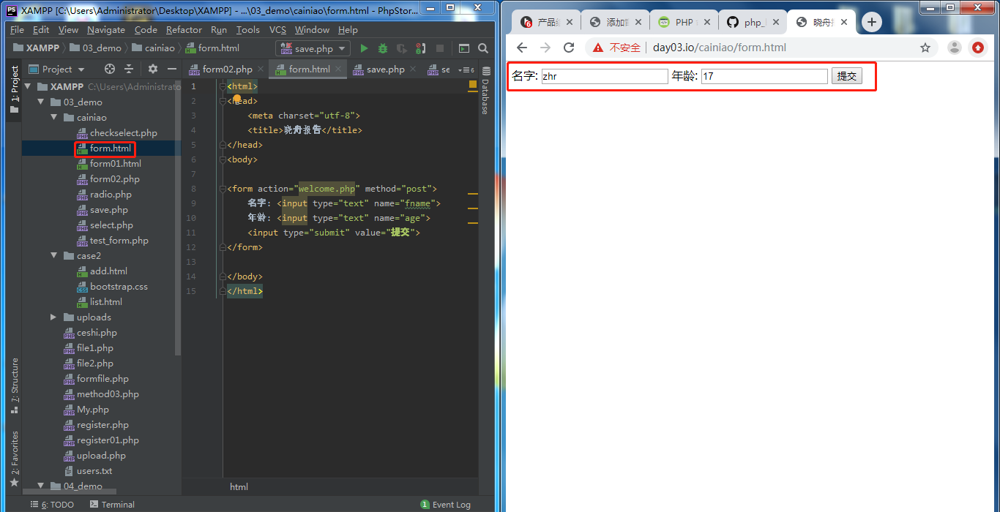

# 表单的基本使用
本接我们来了解一下php表单的简单传递

### PHP 表单和用户输入
PHP 中的 \$_GET 和 \$_POST 变量用于检索表单中的信息，比如用户输入。

### PHP 表单处理
有一点很重要的事情值得注意，当处理 HTML 表单时，PHP 能把来自 HTML 页面中的表单元素自动变成可供 PHP 脚本使用。

实例：
下面的实例包含了一个 HTML 表单，带有两个输入框和一个提交按钮。

``` php
//form.html 文件中的代码：
<html>
<head>
<meta charset="utf-8">
<title>小周报告</title>
</head>
<body>
 
<form action="welcome.php" method="post">
名字: <input type="text" name="fname">
年龄: <input type="text" name="age">
<input type="submit" value="提交">
</form>
 
</body>
</html>
```

当用户填写完上面的表单并点击提交按钮时，表单的数据会被送往名为 "welcome.php" 的 PHP 文件：

``` php
//save.php 文件代码：
欢迎<?php echo $_POST["fname"]; ?>!<br>
你的年龄是 <?php echo $_POST["age"]; ?>  岁。
```

结果如下显示：

这是post提交数据页面

这是post接受数据页面

我们将在下一章中详细讲解 PHP 中的 \$_GET 和 \$_POST 变量。

### PHP 获取下拉菜单的数据
#### PHP 下拉菜单单选
以下实例我们设置了下拉菜单三个选项，表单使用 GET 方式获取数据，action 属性值为空表示提交到当前脚本，我们可以通过 select 的 name 属性获取下拉菜单的值：

``` php
//select.php中的代码
<?php
$q = isset($_GET['q'])? htmlspecialchars($_GET['q']) : '';
if($q) {
    if($q =='xiaozhou') {
        echo '小周报告<br>http://www.xiaozhou.com';
    } else if($q =='GOOGLE') {
        echo 'Google 搜索<br>http://www.google.com';
    } else if($q =='TAOBAO') {
        echo '淘宝<br>http://www.taobao.com';
    }
} else {
    ?>
    <form action="" method="get">
        <select name="q">
            <option value="">选择一个站点:</option>
            <option value="xiaozhou">xiaozhou</option>
            <option value="GOOGLE">Google</option>
            <option value="TAOBAO">Taobao</option>
        </select>
        <input type="submit" value="提交">
    </form>
    <?php
}
?>
```

#### PHP 下拉菜单多选
如果下拉菜单是多选的（ multiple="multiple"），我们可以通过将设置 select name="q[]" 以数组的方式获取，以下使用 POST 方式提交，代码如下所示：

``` php
//checkselect.php中的代码
<?php
$q = isset($_POST['q'])? $_POST['q'] : '';
if(is_array($q)) {
    $sites = array(
        'xiaozhou' => '小周报告: http://www.xiaozhou.com',
        'GOOGLE' => 'Google 搜索: http://www.google.com',
        'TAOBAO' => '淘宝: http://www.taobao.com',
    );
    foreach($q as $val) {
        // PHP_EOL 为常量，用于换行
        echo $sites[$val] . PHP_EOL;
    }

} else {
    ?>
    <form action="" method="post">
        <select multiple="multiple" name="q[]">
            <option value="">选择一个站点:</option>
            <option value="xiaozhou">xiaozhou</option>
            <option value="GOOGLE">Google</option>
            <option value="TAOBAO">Taobao</option>
        </select>
        <input type="submit" value="提交">
    </form>
    <?php
}
?>
```

#### 单选按钮表单
PHP 单选按钮表单中 name 属性的值是一致的，value 值是不同的，代码如下所示：

``` php
//radio.php中的代码
<?php
$q = isset($_GET['q'])? htmlspecialchars($_GET['q']) : '';
if($q) {
    if($q =='xiaozhou') {
        echo '小周报告<br>http://www.xiaozhou.com';
    } else if($q =='GOOGLE') {
        echo 'Google 搜索<br>http://www.google.com';
    } else if($q =='TAOBAO') {
        echo '淘宝<br>http://www.taobao.com';
    }
} else {
    ?><form action="" method="get">
        <input type="radio" name="q" value="xiaozhou" />小周报告
        <input type="radio" name="q" value="GOOGLE" />Google
        <input type="radio" name="q" value="TAOBAO" />Taobao
        <input type="submit" value="提交">
    </form>
    <?php
}
?>

```

#### checkbox 复选框
PHP checkbox 复选框可以选择多个值：
``` php
//checkbox.php中的代码
<?php
$q = isset($_POST['q'])? $_POST['q'] : '';
if(is_array($q)) {
    $sites = array(
        'xiaozhou' => '小周报告: http://www.xiaohzou.com',
        'GOOGLE' => 'Google 搜索: http://www.google.com',
        'TAOBAO' => '淘宝: http://www.taobao.com',
    );
    foreach($q as $val) {
        // PHP_EOL 为常量，用于换行
        echo $sites[$val] . PHP_EOL;
    }

} else {
    ?><form action="" method="post">
        <input type="checkbox" name="q[]" value="xiaozhou"> 小周报告<br>
        <input type="checkbox" name="q[]" value="GOOGLE"> Google<br>
        <input type="checkbox" name="q[]" value="TAOBAO"> Taobao<br>
        <input type="submit" value="提交">
    </form>
    <?php
}
?>
```

### 表单验证
我们应该尽可能的对用户的输入进行验证（通过客户端脚本）。浏览器验证速度更快，并且可以减轻服务器的压力。

如果用户输入需要插入数据库，您应该考虑使用服务器验证。在服务器验证表单的一种好的方式是，把表单的数据传给当前页面（异步提交的方式更好），而不是跳转到不同的页面。这样用户就可以在同一张表单页面得到错误信息。用户也就更容易发现错误了。