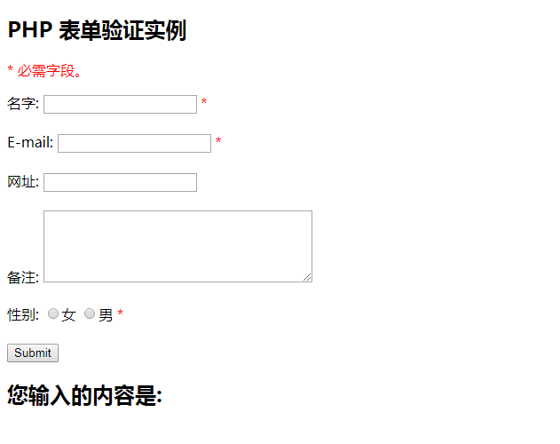

# 表单验证
本章节我们将介绍如何使用PHP验证客户端提交的表单数据。

### PHP 表单验证
在处理PHP表单时我们需要考虑安全性。

本章节我们将展示PHP表单数据安全处理，为了防止黑客及垃圾信息我们需要对表单进行数据安全验证。

在本章节介绍的HTML表单中包含以下输入字段： 多选，单选按钮，及提交按钮和报错信息：


案例地址:[demo01](https://github.com/xiaozhoulee/php_example/blob/master/03-%E8%A1%A8%E5%8D%95/%E7%AC%AC04%E8%8A%82%EF%BC%9A%E7%BB%A7%E6%89%BF/demo01/register.php)

#### 文本字段
"用户名", "密码", 及"确认密码"字段为文本输入元素，HTML代码如下所示:
``` php
<tr>
            <td><label for="username">用户名</label></td>
            <td><input type="text" name="username" id="username" value="<?php echo isset($_POST['username']) ? $_POST['username'] : ''; ?>"></td>
        </tr>
        <tr>
            <td><label for="password">密码</label></td>
            <td><input type="password" name="password" id="password"></td>
        </tr>
        <tr>
            <td><label for="confirm">确认密码</label></td>
            <td><input type="text" name="confirm" id="confirm"></td>
        </tr>
```

此段用表格元素来写的,表格可以使数据看起来更简介一些

#### checkbox按钮

``` php

```