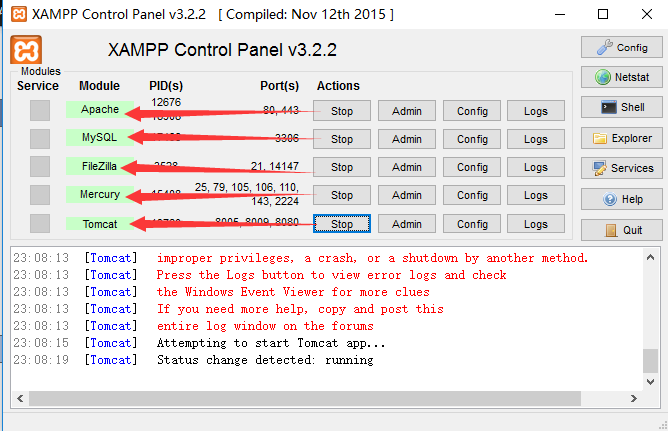
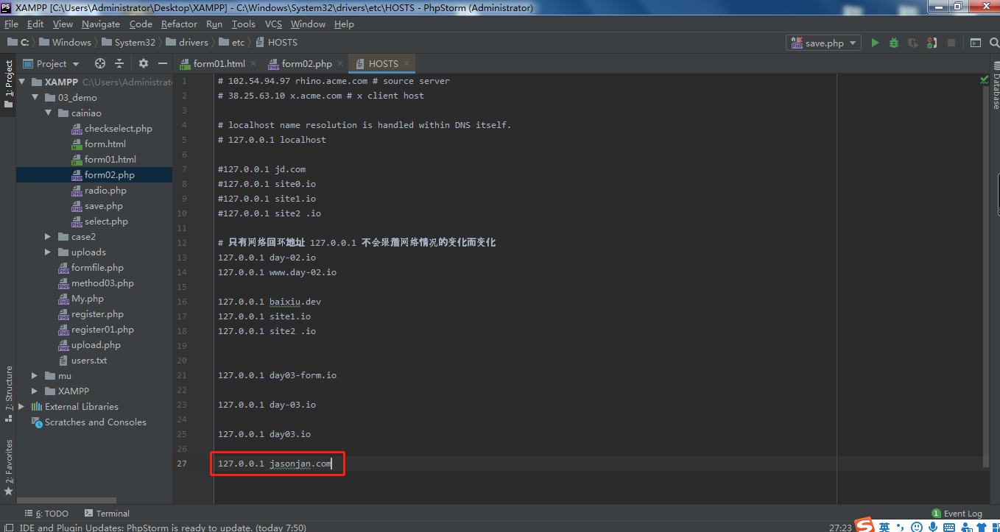
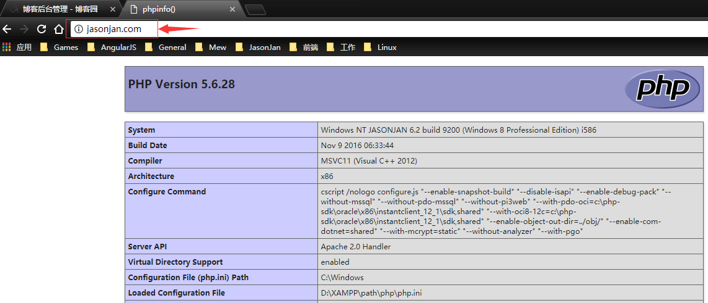

# 第03节:XMAPP的安装与配置
本节我们主要讲解XAMPP软件的下载安装与使用

### 一、学习目标
简单了解XAMPP的作用，XAMPP是一个功能强大的建站集成软件包,它包含 MySQL、PHP 和 Apache，Apache就是我们本节的重点,为php搭建一个一站式集成开发环境

### 二、XAMPP简介及下载
#### 1.XAMPP的简介
开头的X代表X-OS，代表可以在任何常见操作系统下使用，包括Windows、Mac、Linux，开源平台。

XAMPP（Apache+MySQL+PHP+PERL）是一个功能强大的建站集成软件包，这个软件包原来的名字是 LAMPP，但是为了避免误解，最新的几个版本就改名为 XAMPP 了。它可以在Windows、Linux、Solaris、Mac OS X 等多种操作系统下安装使用，支持多语言：英文、简体中文、繁体中文、韩文、俄文、日文等。
许多人通过他们自己的经验认识到安装 Apache 服务器是件不容易的事儿。如果您想添加 MySQL、PHP 和 Perl，那就更难了。XAMPP 是一个易于安装且包含 MySQL、PHP 和 Perl 的 Apache 发行版。XAMPP 非常容易安装和使用：只需下载，解压缩，启动即可。(不需要特殊配置)
 

#### 2.XAMPP的下载：
百度搜索XAMPP，请看下面这张图


点击第二条搜索信息里面的立即下载，下载到具体的路径下

### 三、安装XAMPP
#### 1.首先我在桌面创建了一个文件夹XAMPP，然后在XAMPP创建了三个文件夹。

#### 2.首先下载好XAMPP，放到一个位置，我放在之前下载好的 XAMPP文件及下package 这个位置


#### 3.然后双击，进入安装界面

我将安装路径选择了上面的XAMPP文件夹下的path文件里面

一直next... 直到安装成功

#### 4.直到安装成功后打开软件是这个样子的


#### 5.然后我点击了5个Start，全部绿灯


非常幸运的全部亮了绿灯，说明和之前做的项目没有冲突，表示可用

#### 6.如是红灯的话
如果是Apache中的80,443端口被占用
如果是MySQL中的3306端口被占用

其他的暂时用不上，不会在本节介绍

### 四、配置虚拟主机
#### 1.然后我在D:\XAMPP\virtualhost中新建了一个文件==>index.php


很简单的一个函数，就当做首页了吧。

#### 2.找到XAMPP的安装目录==>apache==>conf==>extra

然后用编辑器打开httpd-vhosts.conf

在文件的最下面写如下代码：　

``` php
<VirtualHost *:80>
# *：80 监听绑定在当前电脑上的任意 TP 的 80端口
 ServerName jasonjan.com # 域名 通过域名来访问这个目录下的php或其他文件
 # 由于多个虚拟主机一同工作, 每个虚拟主机必须配置 serverName(访问的域名)
 DocumentRoot "D:/XAMPP/virtualhost"
<Directory "D:/XAMPP/virtualhost"> 
# 配置这个目录允许被访问 否则出现被禁止的问题 forbidden
 Options FollowSymLinks IncludesNOEXEC Indexes
 DirectoryIndex index.html index.htm index.php
 AllowOverride all 
 Order Deny,Allow 
 Allow from all 
 Require all granted
</Directory>
</VirtualHost>
```

效果图：

#### 3.修改hosts(要以管理员身份运行编辑器)
进入C盘==>Windows==>system32==>drivers==>etc==>找到hosts这个文件

把127.0.0.1 jasonjan.com 填写到hosts文件数据的最后面

127.0.0.1是你网络地址,后面的jasonjan.com是你虚拟主机定义的访问名称


### 五、测试是否XAMPP成功运行
#### 1.先打开Apache，点击运行按钮


#### 2.在浏览器中输入 主机名==>我的主机名为：
jasonjan.com



出现了上面的页面就说明我们已经成功通过XAMPP来搭建服务器了并且通过虚拟主机显示了这张图片上的内容，切记配置虚拟主机时一定要记住：配置虚拟主机的路径是你具体文件夹的根目录

### 六、作业
* 1.了解一下XAMPP的作用以及涉及到的应用软件
* 2.如有红灯的情况，独自解决端口被占用问题
* 3.熟悉虚拟主机的配置及使用